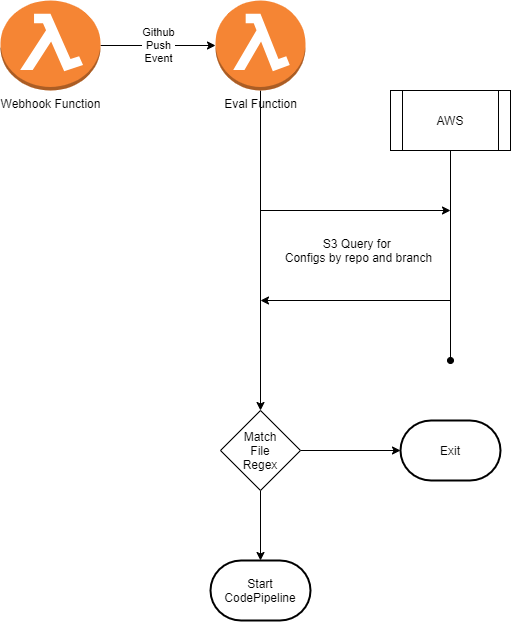

# Mono Repo S3 Based
Using Github WebHooks to drive CodePipeline builds without the need for a single repo per build. Configuration is stored in S3.

* Includes
    * [API Gateway Lambda backed GitHub webhook endpoint](src/webhook)
    * [Lambda function to filter based on S3 configuration](src/eval)
    * [Lambda backed CloudFormation resource to store configuration in S3](src/cfresource)

## Build and Deploy
### Requirements:
* Python 3.8+
* AWS SAM (`pip install aws-sam-cli`)
* pytest (`pip install pytest`)
* boto3 (`pip install boto3`)

### Build & Test
* Run tests: `python -m pytest src/tests/ -v`
* Build `cd src && sam build`

### Deployment
* Set the deployment bucket: `export DEPLOY_BUCKET=my-s3-bucket`
* Set the Webhook HMAC Secret: `export WEBHOOK_SECRET="something secret this way comes"`
* Package: `package.sh`
    * Uses SAM CLI to package artifacts to S3 and output a CF template
* Deploy: `deploy.sh`
    * Uses the AWS CLI to deploy the CloudFormation stack

### One Time Setup
* Manually register the API Gateway endpoint with GitHub as an _organization_ webhook with your secret.

## GitHub Webhook
Responsible for:
* Setting up an API Gateway with an endpoint
* Processing GitHub WebHook Events
    * Validating HMAC Security
    * Looking up defined Lambda Filter functions
    * Async execution of Eval Function for a push event

## GitHub Event Evaluation Lambda Function
Receives a GitHub event, looks up configurations in S3 based on repo and branch, and starts a pipeline event is a match

Responsible for:
* Processing a GitHub Push event
* Triggering a CodePipeline start on match

## CloudFormation Resource
The resource is a lambda function embeds the filter function code package and CloudFormation template. It is called by CloudFormation and must respond to the included URL endpoint with a success/fail status.

Responsible for:
* Create, Update, Delete of Filter Function lambdas
* Updating CloudFormation status

## Architecture and Decisions
Goal of this project is to make it seamless and flexible to support multiple CodePipelines in a single repository using CloudFormation and minimal developer effort. Configuration is stored in S3.

* A single GitHub organizational webhook was chosen for:
    * Pros
        * Webhook needs to respond in a short period of time
        * Security is centralized and only setup in a single place once
        * Only a single API Gateway and lambda function
        * Simplifies the logic of the function itself
        * Can be updated independently of the filter functions
    * Cons
        * Single point of failure or security
* A single evaluation function was chosen for
    * Pros
        * Single function that is simple driving by configuration stored in S3
        * Configuration driven based regular expressions for match of any change, should handle 90%+ of use cases
        * Updated and deployed using CloudFormation
        * Easy to test based on S3 configuration values
        * S3 Configuration values can be manually added and deleted, but shouldn't be
    * Cons
        * Single function will get more complex if additional cases are needed, such as exclude
        * S3 Configuration values can be manually added incorrectly, or manually deleted erroneously
        * Could be slow if the number of matches in s3 is high
        * Convention based for S3 filenames
* Lambda backed CloudFormation was chosen for:
    * Pros
        * Called from CloudFormation to manage associated S3 configuration resources for create, update, delete
        * Minimal addition to the CodePipeline CloudFormation
        * Can be updated independently of deployed functions, next update gets the latest code
    * Cons
        * Failure fails CloudFormation in interesting ways
        * Hard to debug
    * See [example use](examples/cp-example-s3-pipeline.yaml)